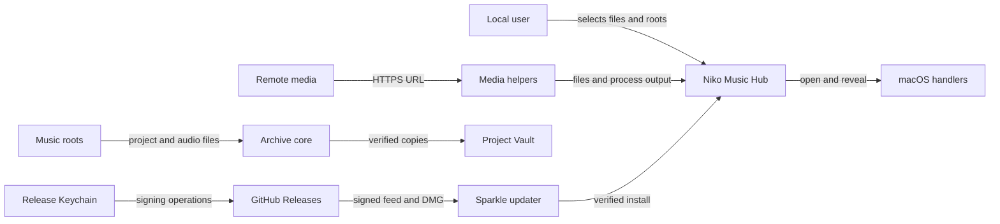

# Niko Music Hub threat model

Repository baseline modeled: `a491a0834d2e96e554e287d22c729dbcb3c6a216` on `main` (2026-09-19). Remediation status below reflects the current uncommitted working tree.

## Executive summary

Niko Music Hub is a single-user, local-first, unsandboxed macOS application with no inbound listener, authentication boundary, or multi-tenancy. The public release gate requires exactly the audio-input entitlement and rejects entitlement drift; its regression tests explicitly reject the App Sandbox entitlement (`script/release-all.sh#NMH_EXPECTED_APP_ENTITLEMENTS`, `Tests/test_release_scripts.sh`). Its dominant security risks are therefore not web-style auth bypasses: they are compromise of the Sparkle release-signing trust root, execution of locally selected third-party helper binaries with the user's privileges, hostile media reaching native or helper parsers, and integrity loss during the explicitly destructive phase of Project Vault. At the modeled baseline, the most actionable source-level gap was narrower: downloader process output could register an existing file outside the chosen output folder in the Output Inbox. Strong existing controls materially reduce risk: signed Sparkle feed and enclosure verification, hardened/notarized public builds, argv-based subprocess launching, read-only archive policy, symlink-aware containment, manifest verification, and fail-closed Vault state transitions.

## Remediation status

- **TM-002 mitigated in the working tree:** local-only releases now skip feed generation unless `NMH_SPARKLE_PRIVATE_KEY_FILE` explicitly names a throwaway test key. They never fall back to the production Keychain account. Public-mode behavior is unchanged.
- **TM-005 mitigated in the working tree:** downloader output candidates now resolve only beneath the selected output directory, with component-aware standardized and symlink-resolved containment. Absolute outside-root, tilde, CWD-relative, traversal, sibling-prefix, and symlink escapes are rejected.
- The remaining medium/high items are defense-in-depth or operational trust risks without a comparably safe bounded source fix in this pass: release-authority concentration (TM-001), helper provenance (TM-003), hostile parser dependencies (TM-004), concurrent-writer Vault TOCTOU (TM-006), and post-publication monitoring (TM-007).

## Scope and assumptions

- **In scope — runtime:** all production Swift targets under `Sources/`, local settings and SQLite/JSON state, selected music roots, Project Vault transfer/restore, the Output Inbox, media preview/opening, external helpers (`ffmpeg`, `yt-dlp`, `demucs-mlx`, and the optional Cubase plug-in reader), and Sparkle update checks/installation.
- **In scope — build/release:** `Package.swift`, `Package.resolved`, `script/release-all.sh`, bundle construction/signing, notarization, feed generation and validation, and GitHub Release publication. These are modeled separately from runtime entry points.
- **Evidence-only, not runtime entry points:** `Tests/`, `Fixtures/`, CLI self-tests, smoke scripts, and documentation.
- **Deployment assumption:** one trusted interactive macOS user; no application server or inbound port; the public app is Developer ID signed, notarized, hardened-runtime enabled, and not App Sandbox constrained (`script/release-all.sh#NMH_EXPECTED_APP_ENTITLEMENTS`, `Tests/test_release_scripts.sh`).
- **Attacker-control assumption:** an attacker may control a media URL, downloaded bytes and metadata, filenames and contents in an imported/shared archive, or a concurrently writable File Provider/shared destination. An attacker cannot silently change local Settings or the release Keychain unless that local/release environment is already compromised.
- **Data sensitivity:** song names, collaborator names, notes, absolute paths, audio/project files, local workflow metadata, and release credentials may be sensitive. The archives are integrity-critical even when not confidential.
- **Out of scope:** unknown vulnerabilities inside macOS, Sparkle, AVFoundation, ffmpeg, yt-dlp, demucs-mlx, GitHub, or Apple notarization; they are represented as external trust dependencies rather than re-audited here.

Open questions that can change ranking:

- Are Active/Vault roots ever shared with untrusted users or continuously rewritten by a cloud/File Provider client? If yes, TM-006 rises.
- Is the Sparkle private key isolated on a dedicated or hardware-backed signing host, separate from the GitHub credential? If yes, TM-001 falls; if not, the single-host compromise path remains.
- Is the live `appcast.xml` independently monitored after publication for signature validity, version monotonicity, and asset mutation? If yes, TM-007 becomes easier to detect.
- Are helper directories writable only by an administrator, and are chosen helper identities reviewed before first use? If yes, TM-003 falls.

## System model

### Primary components

- **App shell and shared services:** composition, settings, jobs, diagnostics, and Output Inbox in `Sources/NikoMusicHub/` and `Sources/AppCore/`.
- **Archive domain:** scan, search, metadata, path safety, opening, SQLite persistence, and Project Vault engines in `Sources/NikoMusicCore/`.
- **Production tools:** converter, recorder, downloader, stem separation, and BPM tapper in independent feature modules.
- **External executables:** absolute-path `ffmpeg`, `yt-dlp`, and `demucs-mlx` processes supervised by `FoundationExternalProcessRunner`; `cubase-project-plugins` is invoked through `/usr/bin/env`.
- **Update client:** `AppUpdates` gates Sparkle creation on an HTTPS feed URL and a valid 32-byte Ed25519 public key.
- **Release trust chain:** local source/toolchain and `.build` artifacts → signed/notarized app and DMG → signed appcast and enclosure → GitHub Releases → installed Sparkle clients.

### Data flows and trust boundaries

- **User/remote media → Downloader helper:** URL and format choices cross via argv to `yt-dlp`; only `http`/`https` plus a nonempty host are accepted. There is no host/IP allowlist or app-level rate limit. `Sources/FeatureDownloader/DownloaderViewModel.swift#validatedHTTPURL`, `Sources/FeatureDownloader/YtDlpDownloadCommandBuilder.swift#downloadArguments`.
- **Helper process → app jobs/Output Inbox:** stdout/stderr and reported paths cross pipes with a 1 MiB captured-output bound, 16 KiB line bound, and 256 candidate-path cap. At the modeled baseline paths were existence-checked but not required to resolve beneath the selected output directory; in the current working tree relative paths resolve only under outputDirectory and absolute outside-root, tilde, CWD-relative, traversal, sibling-prefix, and symlink escapes are rejected. `Sources/AppCore/Services/ExternalProcessRunning.swift#FoundationExternalProcessRunner`, `Sources/FeatureDownloader/YtDlpOutputCollector.swift#finish`.
- **Local helper settings → process execution:** user-selected or auto-detected executable URLs become `posix_spawn` targets. Picker validation checks existence, file type, and executable permission; separate helper-specific health checkers run version/availability probes. Neither establishes a signature or digest. `Sources/AppCore/Settings/HelperExecutableValidation.swift#validate`, `Sources/FeatureDownloader/YtDlpHealthChecker.swift#availability`, `Sources/FeatureAudioConverter/FFmpegHealthChecker.swift#availability`, `Sources/FeatureStemSeparation/DemucsMLXHealthChecker.swift#availability`, `Sources/AppCore/Services/ExternalProcessRunning.swift#launch`.
- **Selected archive roots → scanner/player/opener:** filesystem entries, sidecar text, CPR/ALS data, and audio cross from potentially untrusted storage into bounded parsers, AVFoundation, or `NSWorkspace`. Symlink-aware root containment protects scan/open paths. `Sources/NikoMusicCore/Safety/PathSafety.swift`, `Sources/NikoMusicCore/Scanning/CubaseArchiveScanner.swift`, `Sources/NikoMusicCore/Opening/MusicItemOpener.swift`.
- **Active root → Project Vault archive root:** an explicit or policy-approved operation copies, hashes, verifies, promotes, and only then removes an Active copy. Root overlap, unsafe links, source mutation, capacity, open-file/DAW activity, and recovery phases fail closed. `Sources/NikoMusicCore/Vault/LocalVaultTransferEngine.swift`, `Sources/NikoMusicCore/Vault/VaultManifestCopier.swift`, `Sources/AppCore/ProjectVault/LiveProjectVaultRuntime+Admission.swift`.
- **GitHub Releases → Sparkle:** feed XML and DMG arrive over HTTPS but are trusted only after signed-feed and enclosure verification against the public key embedded in the shipped bundle. Missing/malformed configuration disables updates. `Sources/AppUpdates/AppUpdateConfiguration.swift#resolve`, `Sources/AppUpdates/AppUpdateController.swift#init`, `docs/update-feed.md`.
- **Release Keychain/source/toolchain → public artifact:** Developer ID, notary, GitHub, and Sparkle credentials are used by local release scripts. Exact-commit UAT, clean-tree, Team ID, entitlement, hardened-runtime, notarization, signature, hosted-byte, and feed checks are enforced, but the release workstation remains a concentrated trust boundary. In the current working tree local-only without an explicit `NMH_SPARKLE_PRIVATE_KEY_FILE` skips before `generate_update_feed` and never falls back to the production Keychain account. `script/release-all.sh`, `script/validate-update-feed.py`, `docs/release.md`.

#### Diagram

## Assets and security objectives

| Asset | Why it matters | Security objective (C/I/A) |
|---|---|---|
| Active music projects and archive generations | Irreplaceable creative work; Project Vault can intentionally remove an Active copy | C / **I** / **A** |
| Preview, downloaded, converted, recorded, and stem files | User-created or licensed media handed to other applications | C / I / A |
| Song metadata, notes, collaborators, paths, settings, and bookmarks | Reveals private creative activity and grants durable filesystem access | **C** / I |
| Vault manifests, catalog, and transfer/recovery records | Decide whether a copy is verified and whether destructive phases may proceed | I / A |
| Helper executable identity and process environment | Helper compromise executes with the unsandboxed app user's privileges | **I** |
| Sparkle private key, Developer ID identity, notary profile, GitHub credential | Together can publish code accepted by installed clients | **C** / **I** |
| Signed app, DMG, appcast, release manifest, and approval record | Establish provenance and safe updates | I / A |
| Diagnostics and audit evidence | Supports incident/release investigation; may contain names, notes, or paths | C / I / A |

## Attacker model

### Capabilities

- A remote content operator can induce attacker-chosen media bytes and metadata after the user pastes an HTTP(S) URL.
- A collaborator, shared-drive user, removable disk, or cloud provider can supply hostile filenames, links, project files, sidecars, or media inside a selected root.
- A same-user local process with write access can replace an unpinned helper or race a shared/staging path; this is a strong prerequisite and is stated where required.
- A GitHub credential thief can mutate or remove hosted release/feed assets and cause update denial. A forged feed/enclosure additionally requires the Sparkle private key; fleet installation also requires a replacement bundle installed clients will accept, normally using the expected Developer ID/Team ID. That installer behavior is not proven by this repository.
- A release-host attacker with Keychain, acceptable bundle-signing identity, and GitHub access can create an update that passes the repository's normal release and cryptographic checks.

### Non-capabilities

- No unauthenticated remote caller can invoke an app endpoint: the repository defines no inbound network service.
- A GitHub-only attacker cannot forge the Ed25519 feed or enclosure signature embedded clients require.
- Remote content cannot directly rewrite `HelperToolSettings`; helper replacement requires local action or local filesystem compromise.
- A static `../`, absolute-path, or symlink layout is not enough to escape Project Vault: manifests reject unsafe relative paths and symlinks, and mutation paths are repeatedly canonicalized and checked.
- This model does not treat malware already executing freely as the user as a new privilege escalation; it records only where the app amplifies or fails to contain that condition.

## Entry points and attack surfaces

| Surface | How reached | Trust boundary | Notes | Evidence (repo path / symbol) |
|---|---|---|---|---|
| Downloader URL | User pastes URL and starts a job | Internet → `yt-dlp` | HTTP(S) and host validation only; user-assisted | `Sources/FeatureDownloader/DownloaderViewModel.swift#validatedHTTPURL` |
| Downloader process output | `yt-dlp` stdout/stderr | Helper → job/inbox | Bounded; relative paths resolve only under outputDirectory, with tilde/CWD/outside/traversal/sibling-prefix/symlink escapes rejected (baseline: candidate paths were not output-root contained) | `Sources/FeatureDownloader/YtDlpOutputCollector.swift#finish`, `#urls` |
| Helper executable paths | Settings picker or auto-detection | Local filesystem → process execution | Executable-bit/health validation; no signature/hash | `Sources/AppCore/Settings/HelperExecutableValidation.swift`, `Sources/AppCore/Settings/HelperToolSettings.swift` |
| Archive root selection | Open panel and durable bookmark | Selected storage → scanner | Potentially attacker-supplied names, links, media, CPR/ALS and notes | `Sources/NikoMusicCore/Vault/MusicRootConfiguration.swift`, `Sources/NikoMusicCore/Scanning/CubaseArchiveScanner.swift` |
| Audio/project parsers | Scan, preview, analysis, conversion, stems | Untrusted bytes → native/helper parsers | Several in-app readers are bounded; AVFoundation/helpers remain external attack surfaces | `Sources/NikoMusicCore/Preview/PreviewHookLocator.swift`, `Sources/NikoMusicCore/Scanning/AbletonPluginSummaryReader.swift` |
| Open/reveal actions | User clicks project or inbox item | App URL → Launch Services/handler | Path safety checks archive opens; handler safety is external | `Sources/NikoMusicCore/Opening/MusicItemOpener.swift`, `Sources/FeatureArchiveBrowser/AppKitWorkspaceOpener.swift` |
| Project Vault archive/restore | Explicit confirmation or enabled automation | Active root ↔ archive root | Integrity-critical mutation, verification, promotion, removal, and recovery | `Sources/NikoMusicCore/Vault/LocalVaultTransferEngine.swift`, `LocalVaultRestoreEngine.swift` |
| Local app data | Startup and every metadata/settings action | Application Support/UserDefaults → app logic | Same-user tampering; path checks protect Vault records before mutation | `Sources/NikoMusicCore/Persistence/SQLiteArchiveDatabase.swift`, `Sources/AppCore/Settings/UserDefaultsSettingsStore.swift` |
| Sparkle feed and enclosure | Automatic/manual update check | GitHub/Internet → installer | HTTPS plus signed feed/enclosure; fail-closed | `Sources/AppUpdates/AppUpdateConfiguration.swift`, `docs/update-feed.md` |
| Release pipeline | Local release command | Source, `.build`, Keychain, Apple, GitHub | No hosted CI; strong local gates; concentrated operator trust | `script/release-all.sh`, `script/release-preflight.sh` |
| Diagnostics/index exports | Explicit save action | Sensitive app state → user-chosen file | Path redaction is partial; song titles/notes/index contents may remain | `Sources/NikoMusicCore/Scanning/ArchiveDiagnosticsExporter.swift`, `Sources/NikoMusicCore/Intelligence/ArchiveIndexExporter.swift` |

## Top abuse paths

1. **Fleet update compromise:** attacker compromises the release Mac, Sparkle key, acceptable Developer ID/Team ID signing identity, and GitHub credential → signs a malicious feed and an installable replacement bundle → publishes them at the permanent feed location → automatic Sparkle checks can accept and install attacker code as each user. The repository does not independently prove Sparkle's inner-app acceptance rules.
2. **Local-only release trust confusion (baseline; mitigated in working tree):** at baseline, operator runs `--local-only` while the production public key is present and no test private-key file is supplied → `generate_appcast` uses the default production Keychain account → production-valid feed/enclosure signatures are created over an ad-hoc/local-only artifact → later manual asset mixing can put production signatures on bytes that were never a public candidate. In the current working tree local-only without an explicit `NMH_SPARKLE_PRIVATE_KEY_FILE` skips before `generate_update_feed` and never falls back to the production Keychain account. Whether installed clients accept the inner app is unproven here.
3. **Helper substitution:** user selects, Homebrew/pip installs, or a local process replaces a helper → health check/version output still succeeds → the unsandboxed app launches the helper by absolute path → attacker code inherits the user's filesystem access.
4. **Hostile media/parser path:** user pastes an attacker URL or scans attacker-controlled media → `yt-dlp`, ffmpeg/demucs, AVFoundation, or a bounded in-app parser processes it → a parser bug or resource bomb crashes/hangs the app or, in a vulnerable dependency, executes code as the user.
5. **Downloader inbox confusion (baseline; mitigated in working tree):** at baseline, attacker-influenced helper output reports an existing absolute/out-of-directory media path → collector accepts it because it exists → Output Inbox persists it → user reveals, opens, drags, or analyzes a file that the download did not create. In the current working tree relative paths resolve only under outputDirectory and absolute outside-root, tilde, CWD-relative, traversal, sibling-prefix, and symlink escapes are rejected. No automatic exfiltration or remote RCE is established.
6. **Vault concurrent-writer race:** a local/cloud writer changes a checked source or destination component between `lstat`/containment and `copyItem` → bytes may be written to an unintended transient target or verification fails → post-copy manifest checks prevent promotion/removal in the normal path, but availability and partial-write risk remain.
7. **Hosted update denial:** GitHub-only attacker deletes/replaces `appcast.xml` or the DMG without a valid signature → clients fail closed → users remain on an old vulnerable version until an out-of-band recovery restores a valid feed.

## Threat model table

| Threat ID | Threat source | Prerequisites | Threat action | Impact | Impacted assets | Existing controls (evidence) | Gaps | Recommended mitigations | Detection ideas | Likelihood | Impact severity | Priority |
|---|---|---|---|---|---|---|---|---|---|---|---|---|
| TM-001 | Release-host attacker | Access to the Sparkle private key, GitHub publication, and a Developer ID/Team ID bundle-signing identity that installed clients accept; notarization is part of the normal public path but is not asserted as Sparkle's install gate | Sign and publish malicious update bytes | Conditional fleet-wide arbitrary code as users; signed-feed forgery alone is not proven installable | Signing credentials, installed app, all user-accessible data | Exact Sparkle pin; HTTPS; signed feed and enclosure; candidate-key verification; clean/tagged exact-commit gates; Developer ID, hardened runtime, Team ID, notarization and hosted-byte checks (`Package.swift`, `script/release-all.sh`, `script/validate-update-feed.py`) | Key, bundle-signing identity, and GitHub operations converge on a local operator environment; no independent continuous attestation; inner-app acceptance is outside this repo | Separate GitHub and Sparkle signing authority; dedicated/hardware-backed signing host; two-person publication; prohibit emergency skips for published builds; document key rotation/recovery | External monitor verifies live feed signature/version/assets; alert on unapproved release/tag; record key fingerprint and signer | low | high | **high** |
| TM-002 | Release-operator error or release-host attacker | `--local-only`, committed production public key present, and no explicit test private key | Default `generate_appcast` path uses the production Keychain account to sign a local-only ad-hoc DMG; artifact/feed later mixed into production | Trust-boundary confusion: production-valid feed/enclosure signatures over a non-public artifact; Sparkle install acceptance of the inner app is unproven | Update trust, release artifacts | Local-only cannot publish and is labeled unsigned/unnotarized (`script/release-all.sh:446-448,498-506`); in the current working tree local-only without an explicit `NMH_SPARKLE_PRIVATE_KEY_FILE` skips before `generate_update_feed` and never falls back to the production Keychain account (baseline: key selection defaulted to Keychain account `ed25519` and feed generation still ran (`script/release-all.sh:316-324,732-737`)) | Baseline gap (local-only did not require a throwaway key and still invoked Keychain signing when the public key existed) is mitigated in the working tree as stated; residual is manual out-of-band asset mixing | Implemented in working tree: local-only requires `NMH_SPARKLE_PRIVATE_KEY_FILE` or skips appcast generation; rejects the production key/account; test this invariant | Log mode, feed URL, public-key fingerprint and signing account; scan `dist/release` for prod-key local artifacts | low | high (conditional) | **medium** |
| TM-003 | Local binary supplier, local process, or tricked user | User chooses or auto-detects a malicious/replaced helper; or helper directory is writable | Run malicious `yt-dlp`, ffmpeg, demucs, or PATH-resolved plug-in reader | Arbitrary code with unsandboxed user privileges | Archives, outputs, settings, app data | Direct executable URLs and argv arrays avoid shell injection; health/version checks; bounded process output and process-group cancellation (`Sources/AppCore/Services/ExternalProcessRunning.swift`, helper health checkers) | Existence/executable/version checks do not establish provenance; downloader prepends helper directories to inherited PATH; `cubase-project-plugins` uses `/usr/bin/env` (`Sources/FeatureArchiveBrowser/ArchiveSongAnalysisCoordinators.swift#refresh`) | Display/hash/sign helper identity; warn and re-confirm on change; prefer immutable package-manager paths; pass minimal environment; invoke plug-in reader by absolute path; treat unparseable versions as unusable | Persist helper path/hash/signing identity; alert on changes or unexpected child executable | low | high | **medium** |
| TM-004 | Remote media/project supplier | User downloads or scans attacker-controlled content | Feed malformed or resource-intensive media/project bytes to AVFoundation, helpers, gzip/XML/CPR readers | App/helper crash or resource exhaustion; dependency vulnerability could yield code execution | Availability, unsandboxed execution context, local outputs | Bounded sidecar, WAV, ALS/gzip/XML and CPR reads; external process output bounds; cancellation/stall controls; playlist/candidate caps (`SidecarNotesReader.swift`, `AbletonPluginSummaryReader.swift`, `CPRPluginSummaryService.swift`, `YtDlpOutputCollector.swift`) | AVFoundation and external helpers process complex formats; app has no sandbox or dedicated parser isolation | Keep helpers/frameworks patched; apply input-size/duration limits before analysis; use dedicated per-job output directories and minimal environment; consider process isolation for risky parsers | Log parser/helper crashes, timeouts, memory/output-limit hits and repeated hostile sources without logging URLs publicly | medium | medium | **medium** |
| TM-005 | Remote content influencing helper output, or compromised helper | Successful job reports an existing path outside the output directory | Emit absolute, tilde, or CWD-relative path accepted by collector; persist it in Output Inbox | Inbox integrity loss and user-assisted access to an unrelated media file; no automatic exfiltration/delete/RCE shown | Output Inbox, privacy of local media paths/files | 16 KiB line and 256 candidate caps; file existence and regular-file checks; extension allowlists for handoff (`YtDlpOutputCollector.swift`, `DownloaderViewModel.swift#regularFileExists`, `OutputHandoff.swift`); in the working tree collector resolves relative paths only under outputDirectory with standardized and symlink-resolved containment and rejects absolute outside-root, tilde, CWD-relative, traversal, sibling-prefix, and symlink escapes (baseline: no resolved containment beneath output directory with CWD and tilde fallbacks) | Collector containment implemented in working tree; inbox layer still does not separately revalidate origin; yt-dlp output-root pinning remains hardening | Implemented in working tree for collector (containment, CWD/tilde removal, traversal/absolute/sibling/symlink tests); inbox-layer revalidation and explicit yt-dlp output-root pinning remain as hardening | Count and privately log rejected outside-root candidates; show a security-neutral job failure | low | medium | **low** |
| TM-006 | Same-user process, shared-drive user, or File Provider race | Write access during a Vault copy/remove operation | Swap filesystem component between check and copy/remove | Partial unintended write, failed transfer, or in worst case archive/Active integrity loss | Music projects, Vault generations, transfer records | Symlink/traversal rejection; canonical non-overlapping roots; per-entry manifests/hashes; repeated path validation; source-mutation checks; open-file/DAW admission; verify-before-removal; recovery stops at destructive phases (`PathSafety.swift`, `VaultManifestCopier.swift`, `LocalVaultTransferEngine.swift`) | `lstat`/containment then pathname-based `copyItem` retains a TOCTOU window; some archive staging uses whole-tree copy before postflight | Prefer descriptor-relative `O_NOFOLLOW` copy; always use manifest-driven copier; re-bind source/destination identity immediately before mutation; document shared/File Provider residual risk | Alert on `sourceMutated`, unsafe-path, manifest mismatch and recovery-required states; retain evidence without retry loops | low | high | **medium** |
| TM-007 | GitHub Release attacker without Sparkle private key | GitHub account/token or Release write access | Delete, replace, regress, or retarget the mutable `latest/download/appcast.xml` and assets | Update outage/freeze and delayed security fixes; not unsigned code execution | Update availability and version currency | Ed25519 feed/enclosure verification against bundled key; HTTPS; version monotonicity and point-in-time hosted validation; create-only publication (`docs/update-feed.md`, `script/release-all.sh`) | `latest` is mutable; point-in-time validation does not detect later changes; feed URL is embedded permanently | Protect tags/releases and asset overwrite with repository rules; continuously mirror/verify feed; maintain a signed recovery/advisory channel | Periodic signature and asset-hash monitor; alert on version regression, missing assets, or client verification failures | low | medium | **medium** |

## Criticality calibration

- **Critical:** a practical unauthenticated path to execute code on all clients; compromise of the live Sparkle key, publication authority, and a bundle-signing identity installed clients accept; a deterministic Vault flaw that deletes both Active and verified archive copies without confirmation. No current threat is ranked critical because these prerequisites were not demonstrated.
- **High:** a low-likelihood but credible compromise of the release trust root affecting the fleet (TM-001); a confirmed pre-auth parser RCE in a shipped dependency; a repeatable cross-root Vault deletion primitive.
- **Medium:** local helper substitution with strong local prerequisites (TM-003); hostile media causing bounded/unbounded availability impact (TM-004); baseline conditional production-key release footgun (TM-002, mitigated in working tree where local-only without an explicit `NMH_SPARKLE_PRIVATE_KEY_FILE` skips before `generate_update_feed`); low-likelihood destructive TOCTOU (TM-006); hosted update denial (TM-007).
- **Low:** baseline downloader handoff confusion without demonstrated exfiltration or execution (TM-005, mitigated in working tree where relative paths resolve only under outputDirectory and absolute outside-root, tilde, CWD-relative, traversal, sibling-prefix, and symlink escapes are rejected); privacy exposure only after a user explicitly exports/shares diagnostics; noisy single-job denial with straightforward recovery.

The assumptions most affecting ranking are single-user deployment, absence of inbound networking, whether roots are concurrently writable by untrusted parties, and whether release credentials are independently isolated.

## Focus paths for security review

| Path | Why it matters | Related Threat IDs |
|---|---|---|
| `script/release-all.sh` | Central build/sign/notarize/feed/publish control; local-only key behavior | TM-001, TM-002, TM-007 |
| `script/validate-update-feed.py` | Independent feed and enclosure signature verifier | TM-001, TM-007 |
| `Sources/AppUpdates/` | Runtime gate deciding whether Sparkle exists and can install | TM-001, TM-007 |
| `Sources/AppCore/Services/ExternalProcessRunning.swift` | Canonical unsandboxed subprocess boundary and resource controls | TM-003, TM-004 |
| `Sources/AppCore/Settings/HelperExecutableValidation.swift` | Establishes helper trust using only filesystem/executable checks | TM-003 |
| `Sources/FeatureDownloader/DownloaderHelperToolResolver.swift` | Builds inherited/prepended PATH for downloader helpers | TM-003 |
| `Sources/FeatureArchiveBrowser/ArchiveSongAnalysisCoordinators.swift` | Invokes the optional CPR plug-in helper through `/usr/bin/env` | TM-003 |
| `Sources/FeatureDownloader/YtDlpDownloadCommandBuilder.swift` | Defines URL, output-template, playlist and helper arguments | TM-004, TM-005 |
| `Sources/FeatureDownloader/YtDlpOutputCollector.swift` | Converts untrusted process text into trusted local URLs | TM-005 |
| `Sources/AppCore/OutputInbox/OutputHandoff.swift` | Last handoff gate before reveal/open/drag | TM-005 |
| `Sources/NikoMusicCore/Safety/PathSafety.swift` | Shared symlink-aware containment primitive | TM-006 |
| `Sources/NikoMusicCore/Vault/VaultManifestCopier.swift` | Check/copy boundary containing the residual pathname race | TM-006 |
| `Sources/NikoMusicCore/Vault/LocalVaultTransferEngine.swift` | Verification, promotion, removal and recovery state machine | TM-006 |
| `Sources/NikoMusicCore/Vault/LocalVaultRestoreEngine.swift` | Archive materialization and verified restore path | TM-006 |
| `Sources/NikoMusicCore/Scanning/AbletonPluginSummaryReader.swift` | Complex compressed/XML input with explicit hardening | TM-004 |
| `Sources/NikoMusicCore/Scanning/CPRPluginSummaryService.swift` | CPR in-process parser bounds and external-reader output parsing | TM-004 |
| `Sources/NikoMusicCore/Scanning/ArchiveDiagnosticsExporter.swift` | Explicit export may include sensitive titles, notes, and paths | Privacy follow-up |

## Quality check

- [x] Covered discovered user, filesystem, subprocess, network/update, persistence, export, and release entry points.
- [x] Represented every trust boundary in at least one abuse path and threat.
- [x] Kept runtime findings separate from developer/release tooling.
- [x] Calibrated local/same-user prerequisites rather than presenting them as remote compromise.
- [x] Distinguished GitHub-only update denial from private-key-backed update execution.
- [x] Distinguished strong static Project Vault path controls from the narrower concurrent-writer race.
- [x] Recorded unresolved deployment/key-isolation assumptions and conditional rankings.
- [x] Avoided secrets and did not reproduce key material, tokens, personal archive content, or private paths.
