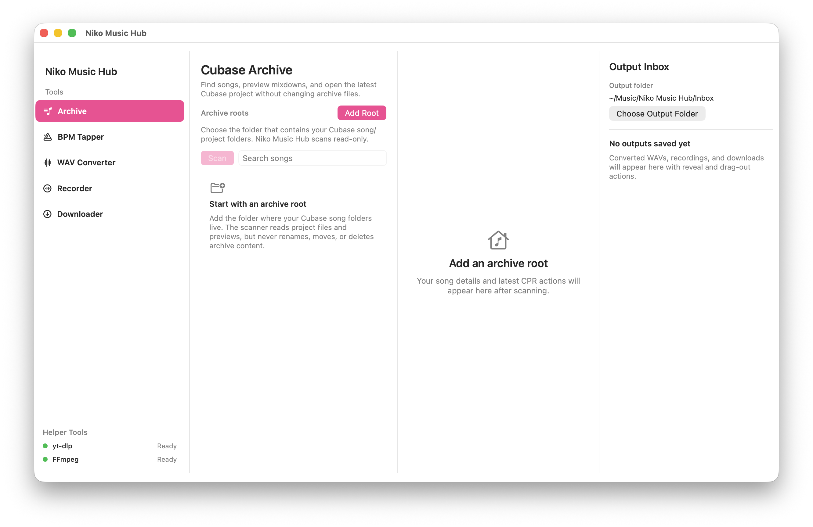

# Niko Music Hub

Native macOS SwiftUI app for music-production chores around Cubase: browse a local Cubase archive, tap tempos, convert audio to Cubase-ready WAV, record system audio, download media, and collect generated files in one output inbox.



The app is local-first. Archive scanning is read-only by default: it never renames, moves, deletes, or rewrites real Cubase/music files.

## Build and run

Requirements:

- macOS 14.2 or newer
- Xcode with the Swift 6 toolchain
- Optional helper tools for all workflows: `ffmpeg` and `yt-dlp`

```bash
./script/build_and_run.sh
```

Produces `dist/NikoMusicHub.app`. The first launch starts clean: add the folder that contains your Cubase song/project folders, choose an output folder if the default is not right, then scan.

## Local gates

```bash
./script/ci.sh
./script/e2e_user_smoke.sh
./script/build_and_run.sh --verify
```

`ci.sh` skips host-only CoreAudio recorder tests that need a working system-audio capture device.

## Fixtures

```bash
./script/fixtures/generate_cubase_archive_fixtures.sh
swift run NikoMusicCoreSelfTest
```

Fixture archive layout: `Fixtures/CubaseArchive/` (Neon Hook, Second Song, Broken Folder Example).

## Visible tools

| Tool | What it does |
|------|--------------|
| Archive | Scans selected Cubase archive roots, searches songs, previews mixdowns, and opens the newest `.cpr` read-only. |
| BPM Tapper | Tap or press Space to estimate tempo, adjust half/double time, save recent BPMs, and copy results. |
| WAV Converter | Drag or choose audio files, convert to Cubase-ready WAV presets, and hand verified outputs to the inbox. |
| Recorder | Capture system audio on supported macOS versions and save recordings to the selected output folder. |
| Downloader | Download supported URLs through `yt-dlp` into the shared output folder. |
| Output Inbox | Shows generated files from registered tools with reveal/drag-out actions. |

## Safety

- Archive scanning and CPR open are **read-only** toward music roots.
- Use `NIKO_MUSIC_HUB_DRY_RUN_OPEN=1` for automation (logs path, does not open Cubase).
- App metadata lives under `~/Library/Application Support/Niko Music Hub/`.
- Developer-only surfaces are hidden from normal builds. Set `NIKO_MUSIC_HUB_SHOW_DEV_TOOL=1` only when working on app internals.

## Known limitations

- GitHub Actions are not configured; local gates are the source of truth.
- System-audio recording depends on macOS support and local privacy permission.
- `ffmpeg` and `yt-dlp` are optional external tools. The app shows compact helper health, but installing or updating them is still a user action.
- The archive browser is intentionally local-only and does not manage files inside real Cubase archives.

## Automation

`./script/e2e_user_smoke.sh` covers the fixture archive flow, dry-run CPR open, read-only archive proof, diagnostics export parity, and a public first-run UI smoke that rejects prototype labels, fixture paths, temp paths, and exposed diagnostics in the normal app window.

The real public-release UAT record is in `docs/public-release-real-uat-2026-05-26.md`. It covers live archive, BPM, converter, downloader, output-folder, helper-health, and Output Inbox flows. Recorder remains blocked on local macOS microphone/audio-capture permission until the user grants access.

See `docs/user-e2e.md` for smoke details and `AGENTS.md` for agent workflow rules.
