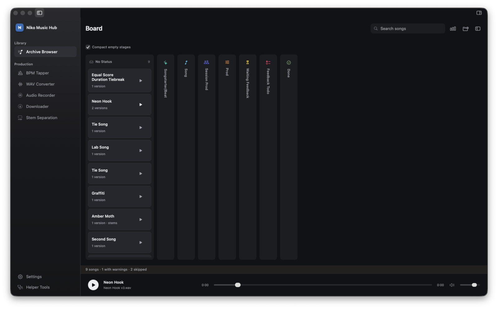
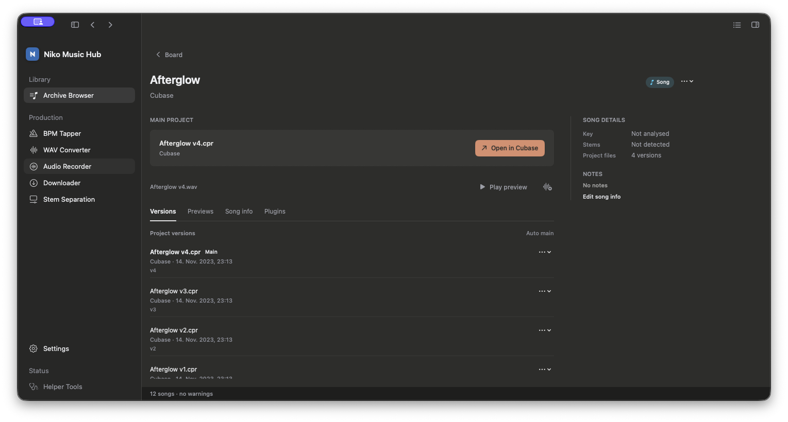
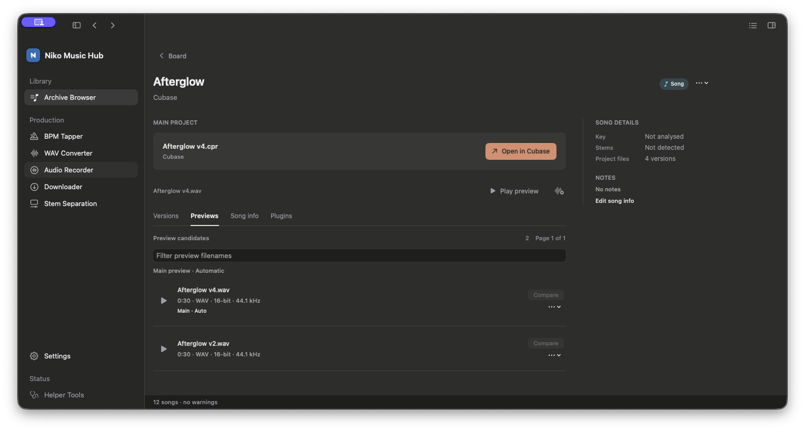
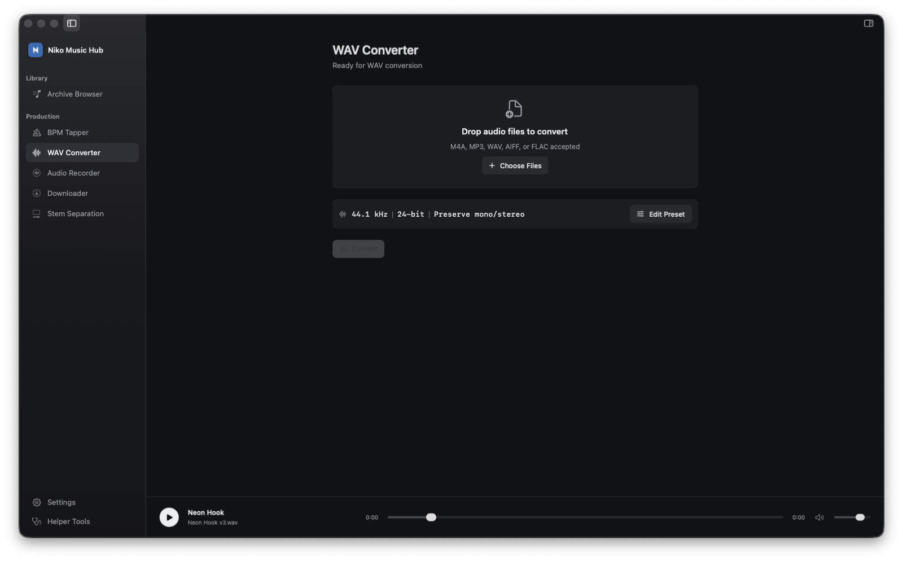
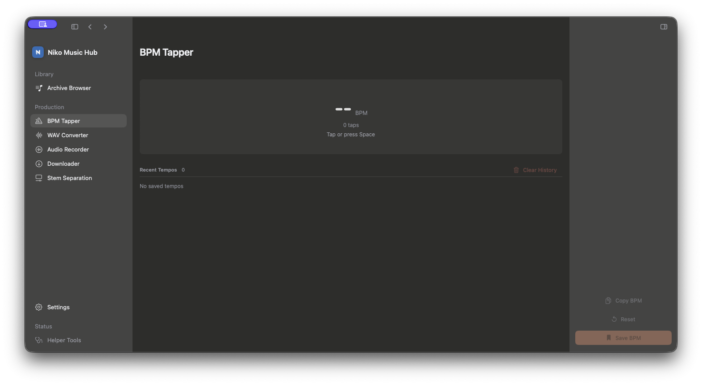
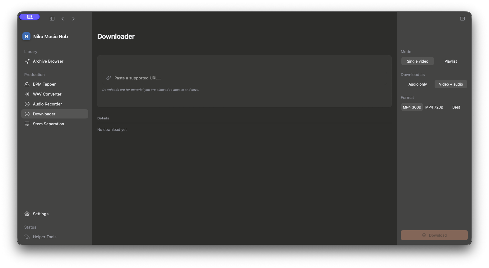
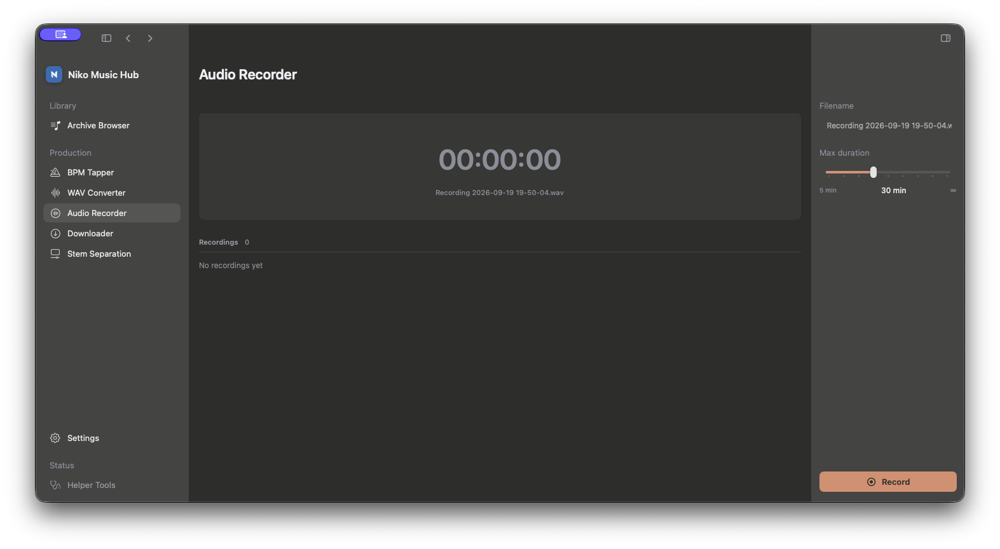

<p align="center">
  
</p>

<h1 align="center">Your songs. Back in reach.</h1>

<p align="center">
  <strong>Niko Music Hub</strong><br>
  A native Mac workspace for your music between sessions.<br>
  Find the project. Hear the bounce. Keep creating.
</p>

<p align="center">
  <a href="https://github.com/Niko96-dotcom/niko-music-hub/releases/latest"><strong>Download for Mac ↗</strong></a>
  &nbsp; · &nbsp; <a href="#a-place-for-every-stage">Explore the app</a>
  &nbsp; · &nbsp; <a href="CHANGELOG.md">What’s new</a>
</p>

<p align="center">
  
  
  
</p>



<p align="center"><sub>Real app screenshots with a synthetic demo library. Your music stays yours.</sub></p>

## A place for every stage

That idea from last month. The mix you sent for feedback. The project called “final” four times. Keep them within reach, without rearranging the folders your DAW depends on.

| Find your next session | Keep the work moving | Make room with care |
| --- | --- | --- |
| Browse Cubase and Ableton projects as a board or searchable library. Search titles, aliases, notes and collaborators. | Track songs from an early idea through production and feedback. Open the project version you need. | Optional Project Vault verifies archive copies, retains recovery records and restores projects when you need them. |

## Hear where you left off

Audition a bounce before opening a session. The persistent player follows you between pages. Compare two previews at the same elapsed position, choose a main preview, and keep project versions together.



<details>
<summary><strong>See preview comparison</strong></summary>



</details>

## The useful things around your DAW

Convert a bounce, capture system audio, download a reference, separate stems locally, or tap out a tempo. A shared Output Inbox keeps the resulting files ready to reveal or drag into your session.

<table>
<tr>
<td width="50%"><br><strong>WAV Converter</strong><br>DAW-ready formats, sample rates and bit depths.</td>
<td width="50%"><br><strong>BPM Tapper</strong><br>Find the pulse without leaving your workspace.</td>
</tr>
<tr>
<td><br><strong>Downloader</strong><br>Bring references into a consistent output workflow.</td>
<td><br><strong>Audio Recorder</strong><br>Capture system audio directly into your output folder.</td>
</tr>
</table>

**Stem Separation** uses `demucs-mlx` locally. **Menu-bar access** opens your tools quickly. **Signed in-app updates** keep the installed app current.

## Built to respect your library

- **Read-only browsing.** Scanning, previews and project opening do not reorganise or rewrite music files.
- **Optional archival.** Project Vault is off by default. Archival follows explicit authorization, verified-copy and recovery requirements; configured automation follows its own bounded approval contract. Archiving lets you keep a verified copy or archive and free up space; restores keep the song's workflow stage. See [Vault durability](docs/vault-durability.md) and [Vault recovery copies](docs/vault-recovery.md).
- **Local workspace.** The index and settings live on your Mac. Downloads and optional helper installation use their respective network services.
- **One output destination.** Choose where produced files go; the default is `~/Music/Niko Music Hub/Inbox`.

## Install in a minute

**Apple silicon · macOS 14.2 or newer**

1. Get the DMG from the [latest public release](https://github.com/Niko96-dotcom/niko-music-hub/releases/latest).
2. Open it and drag **Niko Music Hub** into **Applications**.
3. Open the app. The **Set Up** window installs the helper tools with one click (**Install All**) and lets you pick your music folder. Both steps are optional and can be done later from **Help → Set Up Helper Tools…**.

Public releases are Developer ID signed and notarized. The release includes a SHA-256 checksum if you want to verify the download. Use **Niko Music Hub → Check for Updates…** for updates; automatic checks are configurable in **Settings → Updates**.

Helper tools: [yt-dlp](https://github.com/yt-dlp/yt-dlp) and [FFmpeg](https://ffmpeg.org) for downloading and some conversions, and [demucs-mlx](docs/user-guide-stem-separation.md) for stem separation. The app downloads them from their official release pages into its own folder (`~/Library/Application Support/Niko Music Hub/Tools`), checks each download's SHA-256 checksum, and never needs Homebrew, Python, or Terminal. Copies you already installed with Homebrew are used too.

[Installation guide](docs/install.md) · [Stem separation guide](docs/user-guide-stem-separation.md) · [Report an issue](https://github.com/Niko96-dotcom/niko-music-hub/issues)

---

## Build from source

```bash
git clone https://github.com/Niko96-dotcom/niko-music-hub.git
cd niko-music-hub
./script/dev.sh run        # builds dist/NikoMusicHub.app and opens it
```

`./script/dev.sh doctor` checks that this Mac has what it needs; `./script/dev.sh check` runs every gate that matters. The two gates are:

```bash
./script/ci.sh              # build, unit tests, release-engineering regression tests
./script/e2e_user_smoke.sh  # drives the real app through the fixture archive
```

Tests run against a synthetic archive under `Fixtures/CubaseArchive/` — empty placeholder projects and near-silent mixdowns generated by `script/fixtures/generate_cubase_archive_fixtures.sh`. Never point tests at a real archive.

### Architecture

| Module | Role |
|---|---|
| `NikoMusicCore` | Pure Swift: scanning, indexing, search, preview ranking, project-vault engine, opening safety. No UI. |
| `AppCore` | Shared shell: tool registry, settings, jobs, output inbox, diagnostics, design system. |
| `FeatureArchiveBrowser` | The board, list, song detail, persistent player and Project Vault UI. |
| `FeatureAudioConverter` · `FeatureAudioRecorder` · `FeatureDownloader` · `FeatureStemSeparation` · `FeatureBPMTapper` | Independent tools registered through the same `ToolFeature` boundary. |
| `AppUpdates` | Sparkle integration, isolated so nothing else links it. |
| `NikoMusicHub` | The app target: composition root, shell, menus, settings. |

Full detail in [`docs/architecture.md`](docs/architecture.md); product intent in [`docs/product-scope.md`](docs/product-scope.md).

### Releases

Releases are built locally and fail closed: a clean tagged checkout, every gate green, an approved exact-commit acceptance record, Developer ID signing, notarization, stapling, and a signed update feed verified against the key inside the shipped app — before a single byte is uploaded. See [`docs/release.md`](docs/release.md), [`docs/release-validation.md`](docs/release-validation.md) and [`docs/update-feed.md`](docs/update-feed.md).

## Contributing

Issues and pull requests are welcome — see [`CONTRIBUTING.md`](CONTRIBUTING.md). Keep product code in Swift, keep archive access read-only, and run both gates before opening a PR. GitHub Actions are intentionally not used; the local gates are the source of truth.

## License

Niko Music Hub is **source-available, not open source**. The source is published so you can read it, audit it and build it for yourself; any other use needs a written agreement — see [`LICENSE`](LICENSE). Third-party components keep their own licenses, listed in [`THIRD_PARTY_NOTICES.md`](THIRD_PARTY_NOTICES.md).
